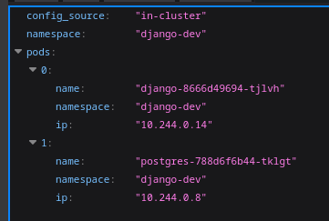

# Pulumi Django on Kind

This repository is a small learning project that shows how to deploy a Django application to a local Kubernetes cluster created with Kind, using Pulumi as the infrastructure definition tool.

The stack includes:

- a Kind cluster for local Kubernetes
- a Pulumi state backend stored in an S3-compatible bucket served by local Garage
- a Django application packaged as a Docker image
- a PostgreSQL database running inside Kubernetes
- Traefik installed with a Helm chart from Pulumi
- an Ingress that routes `django.local` to the Django service
- a small Django view that talks to the Kubernetes API and lists pods from its own namespace

## Project layout

- `infra/`: Pulumi program that creates the Kubernetes resources
- `pulumi-django/`: Django application and Docker image
- `kind-config.yaml`: Kind cluster configuration with port mappings for Traefik
- `Makefile`: helper commands for Kind and Docker image workflows
- `ops/pulumi-config.sh`: helper script to log Pulumi into the local S3-compatible backend

## Prerequisites

You will need the following tools installed locally:

- Docker
- Kind
- `kubectl`
- Pulumi
- Python 3.13
- `uv`

If you want to use the same Pulumi backend configured in this repository, you will also need the local Garage service started through Docker Compose.

## Pulumi backend

This project is configured to use a self-hosted Pulumi backend stored in an S3-compatible bucket exposed by Garage.

The helper script:

```bash
source ops/pulumi-config.sh
```

logs Pulumi into this backend:

```text
s3://pulumi-infra?endpoint=127.0.0.1:33900&disableSSL=true&s3ForcePathStyle=true
```

If you do not want to use the local Garage backend, you can log into any other Pulumi backend manually before running `pulumi up`.

## What the app does

The Django app is exposed through Traefik on:

- `http://django.local:30080/`

The root route and `/cluster-info/` return JSON with the pods visible from the app namespace.



## Reproducing the setup

### 1. Start the local Pulumi backend

If you are using the local Garage-backed Pulumi state storage:

```bash
docker compose up -d
source ops/pulumi-config.sh
```

If you use a different Pulumi backend, log in with your usual `pulumi login` flow instead.

### 2. Create the Kind cluster

The repository includes a Kind config that maps:

- `30080` -> Traefik HTTP
- `30443` -> Traefik HTTPS

Create the cluster with:

```bash
make kind-create
```

### 3. Point the hostname to your machine

Add this line to `/etc/hosts`:

```text
127.0.0.1 django.local
```

### 4. Build and load the Django image into Kind

```bash
make app-image-push
```

This builds the Docker image and loads it into the Kind cluster.

### 5. Deploy the infrastructure with Pulumi

Move into the Pulumi project and apply the stack:

```bash
cd infra
pulumi up --refresh
```

The default development stack configuration is stored in `infra/Pulumi.dev.yaml`.

## Accessing the application

Once the deployment is ready, open:

```text
http://django.local:30080/
```

You can also query the namespace pod view directly:

```text
http://django.local:30080/cluster-info/
```

## Updating the Django app

If you change application code, rebuild and reload the image, then restart the deployment:

```bash
make app-image-push
kubectl -n django-dev rollout restart deployment/django
kubectl -n django-dev rollout status deployment/django
```

Pulumi will not detect code-only changes if the image tag stays the same.

## Useful commands

Check the cluster:

```bash
make kind-status
kubectl get pods -A
kubectl get ingress -A
kubectl get svc -A
```

Recreate the cluster:

```bash
make kind-delete
make kind-create
make app-image-push
cd infra && pulumi up --refresh
```

Inspect Django logs:

```bash
kubectl -n django-dev logs deployment/django --tail=100
```

Inspect Traefik logs:

```bash
kubectl -n traefik logs deployment/traefik --tail=100
```

## Notes

- The Django container runs `migrate` and `collectstatic` at startup.
- The Django app talks to the Kubernetes API using an in-cluster service account.
- The service account is restricted to listing pods only inside its own namespace.
- Traefik is installed from Helm through Pulumi, not by running Helm manually.
